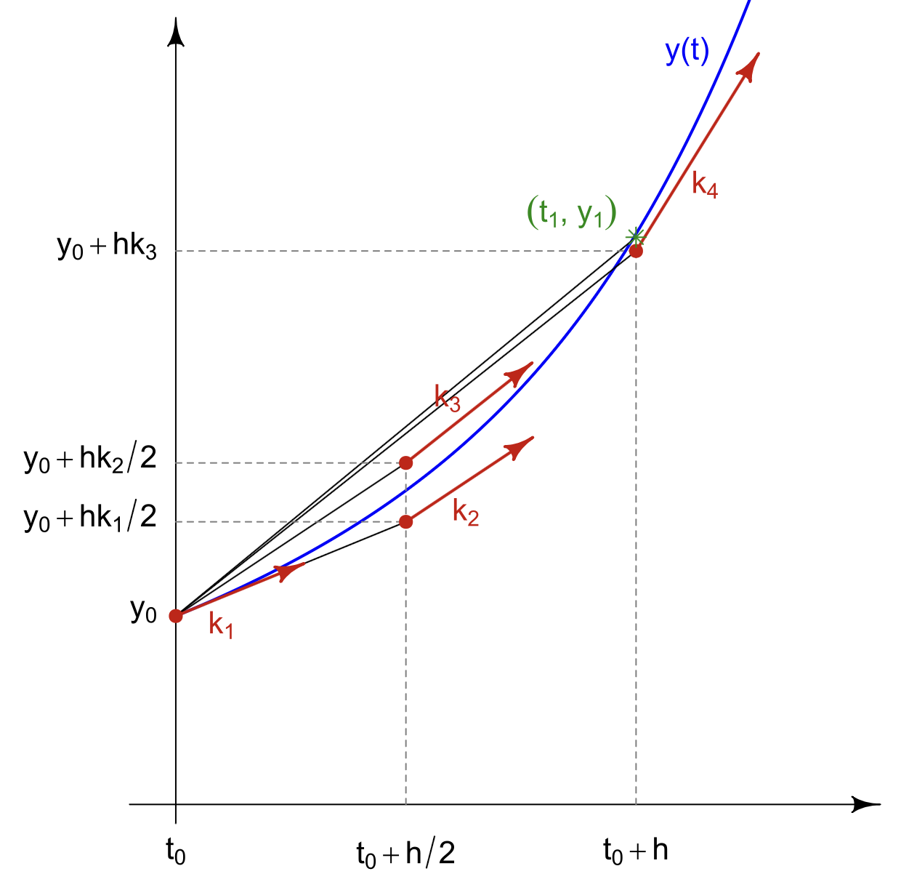

### Indholdsfortegnelse
* [Introduktion.](https://mpsteenstrup.github.io/numerisk_metode/introduktion)
* [Eulers metode.](https://mpsteenstrup.github.io/numerisk_metode/eulers_metode)
* [Bisektion og Newton-Raphson.](https://mpsteenstrup.github.io/numerisk_metode/bisektion_newton_raphson)
* [Runge-Kutta.](https://mpsteenstrup.github.io/numerisk_metode/runge_kutta)

# Runge-Kutta
Der er andre metoder end Eulers metode til at løse differentialligninger. Fra det foregående afsnit ved vi at Eulers metode metode undervurdere y-værdierne hvis funktinen bøjer opad, konkave funktion, og overvurderer y-værdierne hvis funktionen bøjer nedad, konvekse funktioner.

### øvelse
* Tegn funktionen $\( f(x) = x^2 \)$ og argumenter for at tangenten altid vil ligge under grafen.
* Tegn $\( f(x) = \ln(x) \)$ og argumenter for at tangenten altid ligger over grafen. 
* 

To matematikere Carl Runge (1856-1927) og Wilhelm Kutta (1867-1944) udviklede en metode til at imødegå problemet med Eulers metode. Her vil vi gennemgå 4. ordens Runge-Kutta metoden:

### 4. ordens Runge-Kutta 
Figuren nedenfor viser 4.ordens Runge-kutta.
* $\( k_1 \)$ svare til eulers, med tangenthældningen fra (x0,y0).
* $\( k_2 \)$ bruger punktet  $\( (x_0+h/2, y_0+h·k_1 /2) \)$ , d.v.s. tilmærmelsen man fandt som $\( k_1 \)$.
* $\( k_3 \)$ startpunkt kommer ved at tage hældningen fra $\( k_2 \)$ , men startende i $\( x_0 , y_0 \)$.
* $\( k_4 \)$ kommer ved at bruge hældningen fra $\(k_3\)$ fra $\((x_0,y_0)\)$.
* Den endelige y-værdi er $\(y_1 = y_0 + \frac{k_1}{6}+\frac{k_2}{3}+\frac{k_3}{3}+\frac{k_4}{6}\)$

### øvelse
* Forklar ud fra figuren hvordan $\(k_1,k_2,k_3\)$ alle vil given en for lille hældning ved en konveks funktion, mens $\(k_4\)$ giver en for stor en.
* Overvej hvorfor tilnærmelsen ligger medt vægt på $\(k_2, k_3\)$.

Nedenfor er de samme tilnærmelser som i Euler afsnittet. Vurder hvor godt de passer, prøv evt. at lave skridtstørrelsen større.

## RK-1

[https://glowscript.org/#/user/mps/folder/numeriskmetode/program/rk1](https://glowscript.org/#/user/mps/folder/numeriskmetode/program/rk1)

## RK-2

[https://glowscript.org/#/user/mps/folder/numeriskmetode/program/rk2](https://glowscript.org/#/user/mps/folder/numeriskmetode/program/rk2)

## RK-3

[https://glowscript.org/#/user/mps/folder/numeriskmetode/program/rk3](https://glowscript.org/#/user/mps/folder/numeriskmetode/program/rk3)

